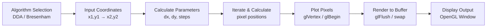
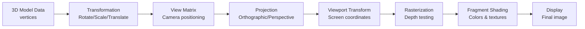

# 🎨 Computer Graphics Algorithms & OpenGL Implementations

> A comprehensive collection of **classic and advanced computer graphics algorithms** implemented in **C++ with OpenGL/GLUT**. Perfect for learning graphics fundamentals, algorithm implementation, and 3D rendering concepts.

---

## 📊 Project Status & Badges

[](https://cplusplus.com)
[](https://www.opengl.org)
[](LICENSE)
[](CONTRIBUTING.md)
[]()

---

## 🎯 Problem Statement

**Understanding computer graphics is challenging without practical implementations.** Students and developers often struggle with:

- ❌ Difficulty understanding graphics algorithms conceptually
- ❌ Lack of practical, production-quality code examples
- ❌ Missing step-by-step explanations of how algorithms work
- ❌ No reference implementations for learning projects
- ❌ Scattered resources across multiple platforms

**This repository solves these problems** by providing:
- ✅ **30+ complete, working implementations** of classic graphics algorithms
- ✅ **Well-documented C++ code** with detailed comments
- ✅ **Live, executable examples** using OpenGL/GLUT
- ✅ **Educational focus** with algorithm explanations
- ✅ **Organized practical exercises** for structured learning

---

## ⭐ Key Features

### **Line Drawing Algorithms**
- 📍 **DDA (Digital Differential Analyzer)** - Simple line rendering
- 📍 **Bresenham's Line Algorithm** - Optimized integer-based line drawing
- 📍 **Arithmetic Symbols & Operators** - Composite figure drawing

### **Circle & Curve Algorithms**
- 🔵 **Bresenham's Circle Algorithm** - Efficient circle rendering
- 🔵 **Parametric curves** - Smooth curve generation

### **2D Shapes & Fills**
- 🏠 **House Design** - Complex 2D shape construction
- 🏠 **Scan-Line Filling** - Polygon fill algorithms
- 🏠 **Letter Rendering** - Character-based graphics

### **3D Graphics & Transformations**
- 🎲 **3D Cube Rendering** - 3D geometry visualization
- 🎲 **Rotation Transformations** - X, Y, Z axis rotations
- 🎲 **Transformation Matrices** - 3D affine transformations
- 🎲 **Depth Buffering** - Proper 3D rendering pipeline

### **Advanced Clipping Algorithms**
- ✂️ **Cohen-Sutherland Line Clipping** - Viewport clipping algorithms
- ✂️ **Window-to-viewport transformation**

---

## 🏗️ Architecture & System Design

```
Computer-Graphics/
│
├── PE/                              # Practical Exercises Directory
│   ├── 30by30/                      # 30 Fundamental Practicals
│   │   ├── DDA_ArithmeticOperators.cpp     # DDA: Drawing operators using line algorithm
│   │   ├── DDA_Home.cpp                    # DDA: Complete house design
│   │   ├── practical_2.1_circle.cpp        # Bresenham circle algorithm
│   │   ├── practical_2.2_line.cpp          # Bresenham line algorithm
│   │   ├── practical_5_LineClipping.cpp    # Cohen-Sutherland clipping
│   │   └── README.md                       # Practical set documentation
│   │
│   ├── CG_Practical/                # Advanced Computer Graphics Practicals
│   │   ├── DDA_Algo/                # DDA Algorithm Implementations
│   │   │   └── Arithmetic.cpp       # DDA: Arithmetic operators
│   │   └── [Other algorithm folders]
│   │
│   └── CG_IMP/                      # Graphics Implementation Reference
│       ├── CubeRY.txt               # 3D Cube: Interactive rotation
│       ├── BresenLineY.txt          # Bresenham line implementation
│       ├── 3d_Transformation_cube.txt # 3D transformation pipeline
│       └── ScanLine_W.txt           # Scan-line fill: Letter W
│
├── README.md                        # This file (Project overview)
├── CONTRIBUTING.md                  # Contribution guidelines
├── LICENSE                          # MIT License
├── CODE_OF_CONDUCT.md              # Community guidelines
└── .gitignore                      # Git ignore patterns
```

### **Workflow: Line Drawing Pipeline**



### **Workflow: 3D Transformation Pipeline**



---

## 🛠️ Technology Stack

| Category | Technology | Purpose |
|----------|-----------|---------|
| **Language** | C++ (C++11/14) | Modern, efficient graphics implementation |
| **Graphics API** | OpenGL 2.x/3.x | Cross-platform rendering standard |
| **Window Management** | GLUT/FreeGLUT | Windowing and input handling |
| **Math Operations** | Standard Library | Vector/matrix calculations |
| **Compilation** | GCC/Clang/MSVC | Cross-platform support |
| **Build System** | Makefile / CMake (Optional) | Build automation |

**Why These Technologies?**
- **C++**: Industry-standard for graphics; excellent performance
- **OpenGL**: Universal graphics API; used in professional graphics
- **GLUT**: Lightweight; perfect for educational implementations
- **Cross-platform**: Code runs on Windows, Linux, macOS

---

## 📦 Installation & Setup

### **Prerequisites**

#### **Windows (MSVC/MinGW)**
```bash
# Using MinGW package manager
pacman -S mingw-w64-x86_64-freeglut mingw-w64-x86_64-gcc

# Or download GLUT from: https://www.opengl.org/resources/libraries/glut/
```

#### **Linux (Ubuntu/Debian)**
```bash
sudo apt-get update
sudo apt-get install freeglut3-dev g++ build-essential
```

#### **macOS**
```bash
# Using Homebrew
brew install freeglut glfw

# Or use system OpenGL framework
```

### **Compilation & Running**

#### **Method 1: Direct GCC/Clang Compilation**
```bash
# Compile a single file
g++ -o output_program DDA_Home.cpp -lGL -lGLU -lglut

# Run the program
./output_program
```

#### **Method 2: Makefile (Recommended)**
```bash
# Create a Makefile in the project root
make build        # Compile all programs
make run          # Run a specific program
make clean        # Remove compiled binaries
```

#### **Method 3: CMake Build System**
```bash
mkdir build
cd build
cmake ..
make
./graphics_program
```

### **Environment Setup**

Create `.env` file (optional for configuration):
```bash
# Graphics Configuration
DISPLAY_WIDTH=500
DISPLAY_HEIGHT=500
WINDOW_TITLE="Computer Graphics"
BACKGROUND_COLOR_R=0.0
BACKGROUND_COLOR_G=0.0
BACKGROUND_COLOR_B=0.0
```

---

## 🚀 Quick Start Guide

### **1. Simple Line Drawing (DDA Algorithm)**
```cpp
// File: DDA_Home.cpp
// Displays a house using DDA line drawing algorithm

// Compile:
g++ -o house_demo DDA_Home.cpp -lGL -lGLU -lglut

// Run:
./house_demo

// Expected Output:
// → OpenGL window with animated rotating house
```

### **2. Bresenham Circle Algorithm**
```cpp
// File: practical_2.1_circle.cpp
// Interactive circle drawing with Bresenham algorithm

// Compile & Run:
g++ -o circle_demo practical_2.1_circle.cpp -lGL -lGLU -lglut
./circle_demo

// Input: Enter center coordinates and radius
// Enter the center coordinates (xc yc) and radius (r): 250 250 100
```

### **3. 3D Rotating Cube**
```cpp
// File: CubeRY.txt
// Interactive 3D cube with real-time rotation

// Left Click   → Rotate around X-axis
// Middle Click → Rotate around Y-axis
// Right Click  → Rotate around Z-axis
```

### **4. Advanced Line Clipping**
```cpp
// File: practical_5_LineClipping.cpp
// Cohen-Sutherland clipping algorithm visualization

// Input:
// p1: -50 -50   (start point)
// p2: 50 50     (end point)
// Clipping window: -100 to 100 (both axes)
```

---

## 📖 Detailed Algorithm Explanations

### **DDA (Digital Differential Analyzer)**
- **Time Complexity**: O(|max(dx, dy)|)
- **Space Complexity**: O(1)
- **Precision**: Floating-point calculations
- **Use Case**: General line drawing

**Algorithm Steps:**
1. Calculate dx = x2 - x1, dy = y2 - y1
2. Determine steps = max(|dx|, |dy|)
3. Calculate x_increment = dx/steps, y_increment = dy/steps
4. Iterate and plot pixels at calculated positions

### **Bresenham's Line Algorithm**
- **Time Complexity**: O(|max(dx, dy)|)
- **Space Complexity**: O(1)
- **Precision**: Integer-only arithmetic (faster)
- **Use Case**: Optimized line rendering

**Key Advantage**: Uses only integer arithmetic, avoiding floating-point errors and improving performance.

### **Bresenham's Circle Algorithm**
- **Time Complexity**: O(radius)
- **Space Complexity**: O(1)
- **Method**: Midpoint circle algorithm
- **Symmetry**: Draws 8 octants simultaneously

### **Cohen-Sutherland Line Clipping**
- **Time Complexity**: O(number of lines)
- **Space Complexity**: O(1)
- **Precision**: Handles clipping window boundaries
- **Use Case**: Viewport clipping operations

---

## 🎮 Usage Examples & Workflows

### **Drawing a House (DDA Algorithm)**
```cpp
// Step 1: Initialize OpenGL window
glClearColor(1.0, 1.0, 1.0, 1.0);  // White background
glMatrixMode(GL_PROJECTION);
gluOrtho2D(0, 400, 0, 400);

// Step 2: Define line drawing function
void drawline(int x1, int y1, int x2, int y2) {
    // DDA algorithm implementation
}

// Step 3: Draw house components
drawline(100, 100, 200, 100);  // Bottom side
drawline(200, 100, 200, 200);  // Right side
// ... more lines
```

### **Interactive 3D Cube Rotation**
```cpp
// Mouse Click Handlers:
- Left Click   → ax = 0; (X-axis rotation)
- Middle Click → ax = 1; (Y-axis rotation)
- Right Click  → ax = 2; (Z-axis rotation)

// Rotation Update:
glRotatef(angle[axis], axis_vector);  // Apply rotation
glutPostRedisplay();                  // Refresh display
```

---

## 📊 Folder Structure & Organization

```
PE/
├── 30by30/                    [30 Fundamental Practicals]
│   ├── DDA_ArithmeticOperators.cpp
│   ├── DDA_Home.cpp
│   ├── practical_2.1_circle.cpp
│   ├── practical_2.2_line.cpp
│   ├── practical_5_LineClipping.cpp
│   └── README.md
│
├── CG_Practical/              [Advanced Implementations]
│   ├── DDA_Algo/
│   │   └── Arithmetic.cpp
│   └── [Additional algorithm folders]
│
└── CG_IMP/                    [Reference Implementations]
    ├── CubeRY.txt
    ├── BresenLineY.txt
    ├── 3d_Transformation_cube.txt
    └── ScanLine_W.txt
```

---

## 🎯 Learning Path & Roadmap

### **Beginner (Week 1-2)**
- [ ] Run DDA line drawing example
- [ ] Run Bresenham circle algorithm
- [ ] Understand algorithm pseudocode
- [ ] Modify parameters and observe changes

### **Intermediate (Week 3-4)**
- [ ] Study 3D transformation matrices
- [ ] Implement basic 3D cube rendering
- [ ] Learn viewport clipping algorithms
- [ ] Implement Cohen-Sutherland clipping

### **Advanced (Week 5-6)**
- [ ] Optimize algorithms for performance
- [ ] Implement scan-line polygon fill
- [ ] Study rasterization techniques
- [ ] Contribute improvements to codebase

### **Expert (Week 7-8)**
- [ ] Implement modern graphics pipeline
- [ ] Add shaders (GLSL) to projects
- [ ] Optimize for large datasets
- [ ] Create tutorial documentation

---

## 📈 Performance & Optimization

### **Algorithm Performance Comparison**

| Algorithm | Time | Space | Precision | Speed |
|-----------|------|-------|-----------|-------|
| DDA Line | O(n) | O(1) | Float | Moderate |
| Bresenham Line | O(n) | O(1) | Integer | **Fast** ⚡ |
| Bresenham Circle | O(r) | O(1) | Integer | **Fast** ⚡ |
| Scan-line Fill | O(area) | O(height) | Integer | Moderate |

### **Optimization Tips**
- Use Bresenham over DDA for production code
- Precompute transformation matrices
- Use double-buffering to prevent flicker
- Implement view frustum culling
- Cache vertex calculations

---

## 🔮 Future Scope & Roadmap

### **Phase 2: Enhanced Graphics Rendering**
- [ ] Implement Gouraud and Phong shading
- [ ] Add texture mapping support
- [ ] Develop shadow rendering algorithms
- [ ] Create particle system effects

### **Phase 3: Modern Graphics Pipeline**
- [ ] Migrate to modern OpenGL (3.3+)
- [ ] Implement GLSL shader programs
- [ ] Add VAO/VBO buffer management
- [ ] Develop advanced lighting models

### **Phase 4: Performance & Tools**
- [ ] Add CMake build system
- [ ] Create interactive tutorial GUI
- [ ] Implement benchmarking tools
- [ ] Add algorithm visualization tools

### **Phase 5: Advanced Features**
- [ ] Implement ray tracing
- [ ] Add volume rendering
- [ ] Develop 3D model loading (OBJ, FBX)
- [ ] Create game engine foundation

---

## 📚 API Documentation

### **Core Graphics Functions**

#### **Line Drawing (DDA)**
```cpp
void drawline(int x1, int y1, int x2, int y2)
// Draws a line from (x1,y1) to (x2,y2) using DDA algorithm
// Parameters: Starting and ending coordinates
```

#### **Circle Drawing (Bresenham)**
```cpp
void drawCircle(int xc, int yc, int r)
// Draws a circle with center (xc,yc) and radius r
// Uses 8-way symmetry for efficiency
```

#### **Pixel Plotting**
```cpp
void setPixel(int x, int y)
// Sets a pixel at screen coordinates (x,y)
// Uses OpenGL point rendering
```

#### **Transformation Rendering**
```cpp
void display()
// Main display callback
// Clears buffer, applies transformations, renders geometry
```

---

## 🤝 Contribution Guidelines

We welcome contributions! Please see [CONTRIBUTING.md](CONTRIBUTING.md) for detailed guidelines.

### **Quick Contribution Process**
1. Fork the repository
2. Create a feature branch (`git checkout -b feature/algorithm-name`)
3. Implement your changes with clear comments
4. Add documentation and test cases
5. Submit a pull request

### **Areas for Contribution**
- 🐛 Bug fixes and optimizations
- 📚 Improved documentation and tutorials
- 🎨 Visual improvements and diagrams
- 🚀 New algorithm implementations
- 🧪 Test cases and benchmarks

---

## 📄 License

This project is licensed under the **MIT License** - see [LICENSE](LICENSE) for details.

**You are free to:**
- ✅ Use this code for personal and commercial projects
- ✅ Modify and distribute the code
- ✅ Include in proprietary applications

**You must:**
- ✅ Include the original license and copyright notice

---

## 👨‍💻 Author & Credits

**Developed by**: [Tushar Kaldate](https://github.com/tusharkkp)

**Inspired by**:
- Computer Graphics textbooks and research papers
- OpenGL and graphics programming communities
- Educational resources from universities worldwide

**Contributing Community**: Thanks to all contributors and users who help improve this project!

---

## 🔗 Related Resources & References

### **Learning Resources**
- [OpenGL Tutorial](https://learnopengl.com) - Modern OpenGL learning
- [Computer Graphics: Principles and Practice](https://www.amazon.com/Computer-Graphics-Principles-Practice-3rd/dp/0321399528) - Textbook reference
- [Bresenham's Algorithm](https://en.wikipedia.org/wiki/Bresenham%27s_line_algorithm) - Wikipedia
- [OpenGL Documentation](https://www.khronos.org/opengl/) - Official reference

### **Tools & Libraries**
- [FreeGLUT](http://freeglut.sourceforge.net/) - Cross-platform GLUT implementation
- [GLFW](https://www.glfw.org/) - Modern window and input library
- [GLM](https://glm.g-truc.net/) - Mathematics library for graphics

### **Similar Projects**
- [Graphics Algorithms](https://github.com/topics/graphics-algorithms)
- [OpenGL Projects](https://github.com/topics/opengl)
- [Computer Graphics Education](https://github.com/search?q=computer-graphics+educational)

---

## 📞 Support & Questions

Have questions? Need help?

- 📝 **Open an Issue**: [Create a GitHub Issue](../../issues)
- 💬 **Start a Discussion**: [GitHub Discussions](../../discussions)
- 📧 **Email**: Contact via GitHub profile

---

## 🌟 Show Your Support

If you found this project helpful:
- ⭐ **Star the repository** - helps with discoverability
- 🔗 **Share with others** - spread the knowledge
- 📝 **Write a review** - help future learners
- 🤝 **Contribute** - improve the codebase

---

## 📊 Project Statistics

- **Language**: C++ (100%)
- **Total Implementations**: 30+
- **Algorithm Coverage**: Line, Circle, Clipping, Transformation, Fill
- **Documentation**: Comprehensive

---

**Last Updated**: January 2026 | **Latest Commit**: [24599cb](https://github.com/tusharkkp/Computer_Graphics/commit/24599cba242f518eef459aad653c1470631f57cd)

---

*Made with ❤️ for computer graphics enthusiasts and students worldwide*
